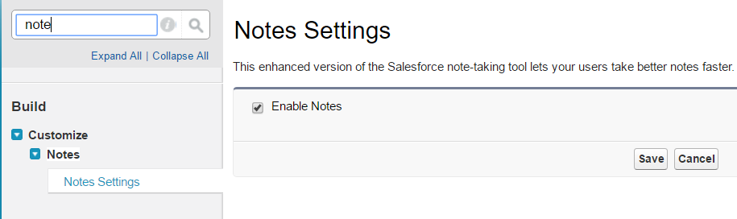
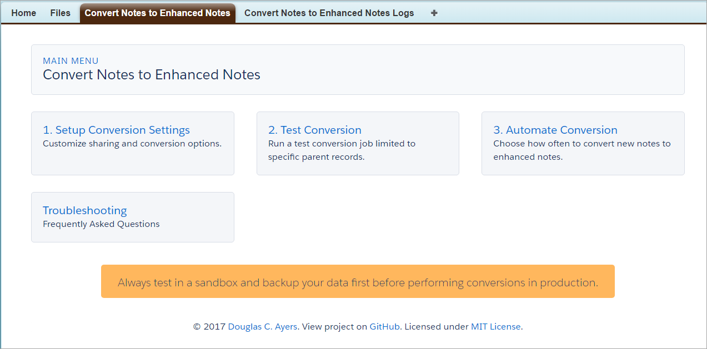
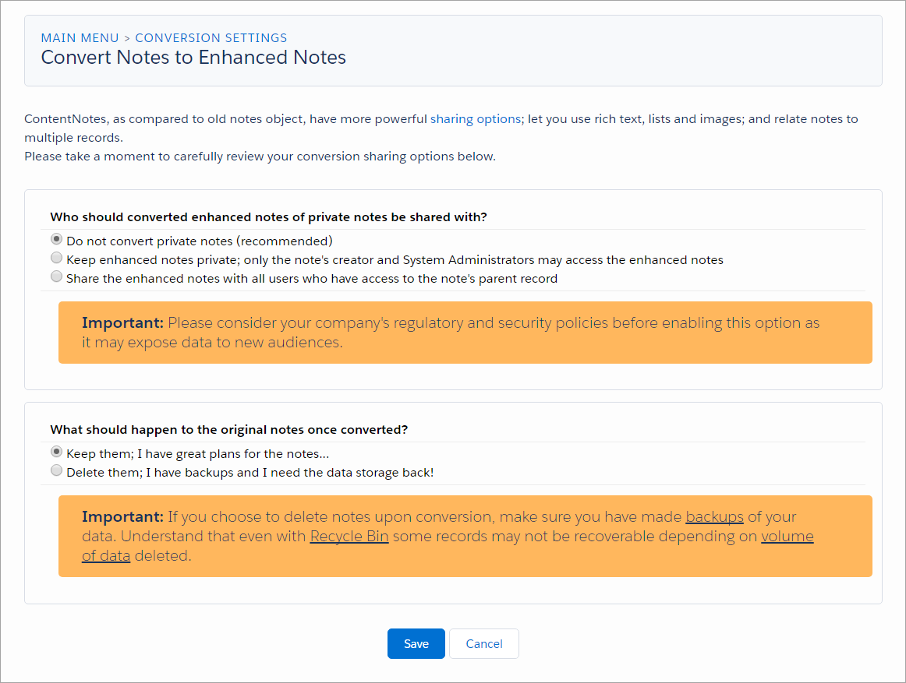

Convert Notes to Enhanced Notes
===============================

Overview
--------

In [Winter '16](https://releasenotes.docs.salesforce.com/en-us/winter16/release-notes/rn_mobile_salesforce1_otherfeat_notes_ga.htm) the new enhanced Notes tool became generally available,
and with it introduced a new "Notes" related list separate from the classic "Notes & Attachments" related list.

In [Spring '17](https://releasenotes.docs.salesforce.com/en-us/spring17/release-notes/rn_files_add_related_list_to_page_layouts.htm) Salesforce announced that in **Winter '18**
the "Notes & Attachments" related list will no longer have an upload or attach button. Customers will be required to migrate to and adopt Salesforce Files.
Although this change is specific to Attachments/Files, it is very clear that "Notes & Attachments" related list will eventually be retired in favor of the new **Files** and **Notes** related lists.

At the time of this project, Salesforce has not (yet?) provided an official conversion tool from Notes to Enhanced Notes.

This project enables the manual or automatic conversion of classic [Notes](https://developer.salesforce.com/docs/atlas.en-us.api.meta/api/sforce_api_objects_note.htm)
into [Enhanced Notes](https://developer.salesforce.com/docs/atlas.en-us.api.meta/api/sforce_api_objects_contentnote.htm)
to take advantage of more sophisticated features, like sharing, revisions, rich text, images, etc.

The package includes visualforce pages that let you:
* Configure sharing and conversion options
* Run test conversions
* Enable near real-time or scheduled conversions

Additional Background:
* [Setup Notes](https://help.salesforce.com/articleView?id=notes_admin_setup.htm)
* [Considerations for Enabling Enhanced Notes](https://help.salesforce.com/articleView?id=000230837&type=1&language=en_US)
* [ContentNote Documentation](https://developer.salesforce.com/docs/atlas.en-us.object_reference.meta/object_reference/sforce_api_objects_contentnote.htm)

Related Ideas
-------------
* [Need to retain original createdDate and time on notes when importing](https://success.salesforce.com/ideaView?id=08730000000BrSsAAK)
* [Ability to Default Sharing Settings on New Notes (Content Note)](https://success.salesforce.com/ideaView?id=0873A000000E2a6QAC)
* [Add "New" Notes to Data Import Wizard with Parent Object Linking](https://success.salesforce.com/ideaView?id=08730000000E1cEAAS)

Pre-Requisites
--------------

* Summer '17 (API 40.0) or later

* Enable [Create Audit Fields](https://help.salesforce.com/articleView?id=000213290&type=1&language=en_US) so Note create/update/owner fields can be preserved on the new enhanced notes

* Enable [New Notes](https://help.salesforce.com/articleView?id=notes_admin_setup.htm) so ContentNote object exists and the new note-taking tool is available

Packaged Release History
------------------------

Release 1.1 (latest)
-----------
* Install package
  * [Production URL](https://login.salesforce.com/packaging/installPackage.apexp?p0=04tf4000000hqFf)
  * [Sandbox URL](https://test.salesforce.com/packaging/installPackage.apexp?p0=04tf4000000hqFf)
* Adds [Ability to Report on Conversions](https://github.com/DouglasCAyers/sfdc-convert-notes-to-chatter-notes/issues/7)
* Adds [Schedulable, Batchable, Queueable classes now 'global'](https://github.com/DouglasCAyers/sfdc-convert-notes-to-chatter-notes/issues/8)
* Fixes [Tests fail if no Partner Community enabled in org](https://github.com/DouglasCAyers/sfdc-convert-notes-to-chatter-notes/issues/6)

Release 1.0
-----------
* Initial release

Installing the Source Code (Developers)
---------------------------------------

You may install the unmanaged code from GitHub and make any desired adjustments. You are responsible for ensuring unit tests meet your org's validation rules and other requirements.

* [Deploy from Github](https://githubsfdeploy.herokuapp.com)

Getting Started
---------------

1. Enable setting [Create Audit Fields](https://help.salesforce.com/articleView?id=000213290&type=1&language=en_US) so Note create/update/owner fields can be preserved on the new enhanced notes
2. Enable setting [New Notes](https://help.salesforce.com/articleView?id=notes_admin_setup.htm) so ContentNote object exists and the new note-taking tool is available
3. Add "Notes" related list to your page layouts (e.g. Accounts, Contacts, Tasks, Events, etc.)
4. Deploy the package using one of the installation links above
5. Assign yourself the permission set **Convert Notes to Enhanced Notes** then switch to the app by the same name
6. On the **Convert Notes to Enhanced Notes** tab page, click on **Setup Conversion Settings** to configure sharing and conversion behavior
7. Perform a **test** conversion
8. Consider **automating** conversion

FAQ
===

Note could not be saved
-----------------------
According to [Salesforce documentation](https://help.salesforce.com/articleView?id=000230867&type=1&language=en_US),
> ContentNote currently provides a generic error like "Note could not be saved." whenever an issue is encountered while parsing the Note file itself. This is often an indication of an issue with the contents of the text body (Content) file, such as special character(s) that have not been properly escaped.

Any conversion errors are reported in the **Convert Notes to Enhanced Notes Logs** object.
If the details reported there are not sufficient for you to resolve the conversion issue then
if you trust me share with me the note trying to be converted and I'll see if I can pinpoint if it's due to special characters or encoding.

Max Documents or Versions Published Governor Limit
--------------------------------------------------
When converting classic Notes & Attachments the new data is stored in the `ContentVersion` object.
There is a [limit to how many of these records can be created in a 24 hour period](https://help.salesforce.com/articleView?id=limits_general.htm&language=en_US&type=0).
With [Summer '17](https://releasenotes.docs.salesforce.com/en-us/summer17/release-notes/rn_files_limits.htm) release the limit is increased from 36,000 to 200,000!
If you have a lot of Notes & Attachments to convert plan around this limit and split the work across multiple days.

Field is not writeable: ContentVersion.CreatedById
--------------------------------------------------
When you deploy the package you might get error that files are invalid and need recompilation and one of the specific messages
might say "Field is not writeable: ContentVersion.CreatedById". The conversion tool tries to copy the notes's original
created and last modified date/user to the converted enhanced note. To do so then the "Create Audit Fields" feature must be enabled.
Please see [this help article](https://help.salesforce.com/articleView?id=000213290&type=1&language=en_US) for instructions enable this feature.

Visibility InternalUsers is not permitted for this linked record.
-----------------------------------------------------------------
When the conversion tool shares the enhanced note to the note's owner and parent record the
**ContentDocumentLink.Visibility** field controls which community of users, internal or external,
may gain access to the enhanced note if they have access to the related record.

When communities are **enabled** then both picklist values `AllUsers` and `InternalUsers` are acceptable.
When communities are **disabled** then only the picklist value `AllUsers` is acceptable.

This error usually means communities are **disabled** in your org and you're trying to set the
visibility of the converted enhanced notes to `InternalUsers`.

To fix then either (a) enable communities or (b) change the visibility option to `AllUsers`.

INSUFFICIENT_ACCESS_OR_READONLY, Invalid sharing type I: [ShareType]
--------------------------------------------------------------------
This error means the object the new file is trying to be shared to does not support the conversion setting **Users inherit view or edit access to the file based on their view or edit access to the attachment's parent record** and instead you must try **Users can only view the file but cannot edit it, even if the user can edit the attachment's parent record**.

This is known to occur with `Solution` object and likely other objects.

FIELD_INTEGRITY_EXCEPTION, Owner ID: id value of incorrect type: 035xxxxxxxxxxxxxxx: [OwnerId]
----------------------------------------------------------------------------------------------
Prior to Spring '12, Salesfore customers could have [Self-Service Portals](https://help.salesforce.com/articleView?id=customize_selfserviceenable.htm), which pre-date the modern Communities we have today.
This error means the Note is owned by a Self-Service User and ContentVersions cannot be owned by them.
You may want to consider changing ownership of those notes to actual user records whose IDs start with **005** prefix.

How are private notes converted?
--------------------------------
Classic Notes & Attachments have an [IsPrivate](https://help.salesforce.com/apex/HTViewHelpDoc?id=notes_fields.htm) checkbox field that when selected
makes the record only visible to the owner and administrators, even through the
Note or Attachment is related to the parent entity (e.g. Account or Contact).
However, ContentNote object follows a different approach. Rather than an
explicit 'IsPrivate' checkbox it uses a robust sharing model, one of the reasons
to convert to the new enhanced notes to begin with! In this sharing model, to
make a record private then it simpy isn't shared with any other users or records.
The caveat then is that these unshared (private) enhanced notes do not show up
contextually on any Salesforce record. By sharing the new enhanced note with the
original parent record then any user who has visibility to that parent record now
has access to this previously private note.

Therefore, when converting you have the option to:

(a) ignore private notes and not convert them

(b) convert and share them with the parent entity

(c) convert them but don't share them with the parent entity, they will reside in the note owner's private library

Inactive Owners
---------------
ContentNote records cannot be created and be owned by an inactive user.
The enhanced notes must be owned by an active user to be created otherwise get error `INACTIVE_OWNER_OR_USER, owner or user is inactive.`.
Prior to running conversion you should either (a) update all old notes with inactive owners to be owned by an active user, or (b) convert them manually first.

If I run the conversion multiple times, do duplicate enhanced notes get created for the same notes?
---------------------------------------------------------------------------------------------------
No, no duplicate enhanced notes should be created once a note has been converted once.
When notes are converted into enhanced notes we store the `Note.ID` in the `ContentVersion.Original_Record_ID__c` field for tracking purposes.
The conversion logic first checks if there exist any enhanced notes that have been stamped with the note id, if yes then we skip converting that note again.

Of course, if you choose the conversion option to delete the notes upon conversion then no such note would exist the second time around.
But if you choose to keep the notes post conversion they will not be converted again if you run conversion process multiple times.

Disclaimer
==========

This is not an official conversion tool by salesforce.com to migrate Notes to Enhanced Notes.
This is a personal project by [Doug Ayers](https://douglascayers.com) to assist customers in migrating to and adopting Enhanced Notes.
Although this tool has been successfully tested with several customers since 2015 that have
between dozens to tens of thousands of notes, please do your own due diligence
and testing in a sandbox before ever attempting this in production.

Always make a backup of your data before attempting any data conversion operations.

You may read the project license [here](https://github.com/DouglasCAyers/sfdc-convert-notes-to-chatter-notes/blob/master/LICENSE).

Special Thanks
==============

* [Arnab Bose](https://www.linkedin.com/in/abosesf/) ([@ArBose](https://twitter.com/ArBose)), Salesforce Product Manager
* [Haris Ikram](https://www.linkedin.com/in/harisikram/) ([@HarisIkramH](https://twitter.com/HarisIkramH)), Salesforce Product Manager
* [Henry Liu](https://www.linkedin.com/in/yenjuilhenryliu/), Salesforce Product Manager
* [David Mendelson](https://www.linkedin.com/in/davidmendelson/), Salesforce Product Manager
* [Neil Hayek](https://success.salesforce.com/_ui/core/userprofile/UserProfilePage?u=00530000003SpRmAAK), Salesforce Chatter Expert
* [Arthur Louie](http://salesforce.stackexchange.com/users/1099/alouie?tab=topactivity), Salesforce Chatter Expert
* [Rick MacGuigan](https://www.linkedin.com/in/rick-macguigan-4406592b/), a very helpful early adopter and tester!
* [David Reed](https://github.com/davidmreed/DMRNoteAttachmentImporter), for insight how to [escape](https://help.salesforce.com/articleView?id=000230867&type=1&language=en_US) HTML tags in original note content
* And to everyone who has provided feedback on this project to make it what it is today, thank you!
